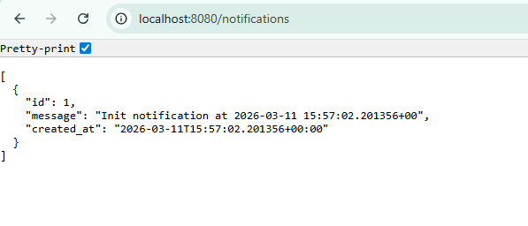

### Prerequisites


| Tool           | Install                                                                                          |
| -------------- | ------------------------------------------------------------------------------------------------ |
| Docker Desktop | [https://www.docker.com/products/docker-desktop](https://www.docker.com/products/docker-desktop) |
| k3d            | [https://k3d.io/#installation](https://k3d.io/#installation)                                     |
| OpenTofu       | [https://opentofu.org/docs/intro/install](https://opentofu.org/docs/intro/install)               |
| kubectl        | [https://kubernetes.io/docs/tasks/tools](https://kubernetes.io/docs/tasks/tools)                 |
| git            | [https://git-scm.com](https://git-scm.com)                                                       |


### Running the project

**Windows:**

```
.\scripts\setup.sh
```

**Linux / macOS:**

```bash
chmod +x scripts/setup.sh
./scripts/setup.sh
```

The script will:

1. Verify all prerequisites are installed and Docker is running
2. Initialise OpenTofu providers
3. Deploy infrastructure (k3d cluster, Postgres, PostgREST, Kubernetes resources)

Once complete, PostgREST is accessible at **[http://localhost:8080](http://localhost:8080)**.

To query the notifications table that is populated every minute by the CronJob:

```
http://localhost:8080/notifications
```

Example response:



### Manual setup

If you prefer to run the steps yourself, from the `tofu/` directory:

```bash
tofu init
tofu apply -target="terraform_data.k3d_cluster" -target="terraform_data.k3d_ready" -auto-approve
tofu apply -auto-approve
```

The k3d cluster must be provisioned before the remaining resources (Postgres, PostgREST, Kubernetes) can be applied, hence the two-phase apply.

